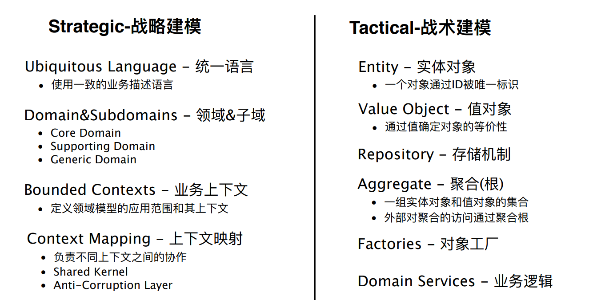

<!--@ Latex -->
<!-- Cần thêm nhiều ví dụ -->
<!-- Tiêu đề chương các mục có tiếng anh -->
<!-- ảnh,  bảng luôn căn giữa -->
<!-- ảnh,  bảng luôn  có 2 begin + end -->
<!-- ảnh luôn dùng [scale] -->
<!-- ảnh luôn có _folder/main -->
<!-- \newpage phải ở   main -->
<!--! có dùng màu -->
\emph{ChuDuocDanhDau}
<!--! có dùng ngăn cách -->
%%%%%%%%%%%%%%%%%%%%%%%%%%%%%%
<!-- \usepackage{wrapfig} -->
<!--@ Latex -->

<!--@ ChatGPT -->
Hãy giúp tôi sửa lỗi chính tả và ngữ pháp và mạch lạc:
Tóm tắt nội dung theo 10 gạch đầu dòng:
<!--! Hãy sử dụng Ngôn ngữ chung (Ubiquitous Language) trong domain driven design (DDD) với nội dung nghiệp vụ kinh doanh sau: -->
<!-- Trình bày về Relationship trong domain driven design -->
<!--@ ChatGPT --> 

<!-- KHOA TOÁN - TIN  -->
<!-- microservices có hình lục giác -->